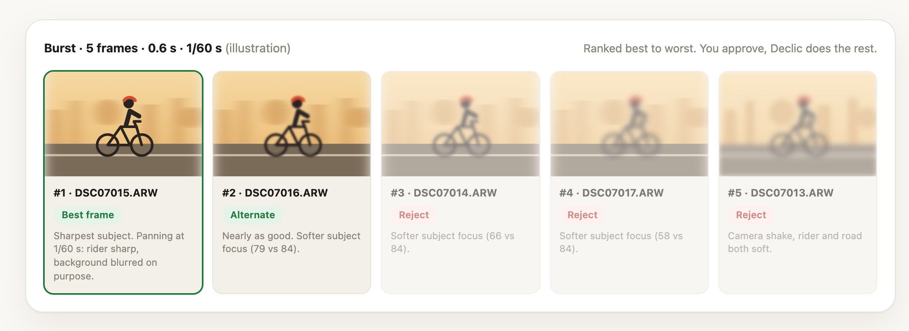

<h1 align="center">declic.</h1>

  Find your keepers. Clear out the rest. 
  A photo culling app that runs entirely on your Mac.

  <a href="https://75link.github.io/declic/">Website</a> ·
  <a href="../../issues/new?template=beta-signup.yml">Join the beta</a> ·
  <a href="ROADMAP.md">Roadmap</a> ·
  <a href="PRIVACY.md">Privacy</a>

  

---

Declic goes through a whole memory card, groups the bursts, picks the sharpest frame and tells you why. It's pronounced *day-kleek*, French for the click of a shutter.

Built for photographers who shoot fast: sports, events, wildlife. When the moment lasts a fraction of a second you shoot in bursts, and one weekend fills a card with thousands of frames that look almost the same. Declic does the first pass and shows you why it picked each frame. You make the final call.

On one race weekend: 3,622 RAW files, 367 bursts, and 65 GB of the 91 GB turned out to be near-identical frames.

> **The code isn't public yet.** I want it to install cleanly on someone else's Mac before I put it out there. This repo is the home for the project in the meantime: the website, the roadmap, and the beta sign-up.

## What it does

- **Groups your bursts** and ranks each frame from best to worst, with a short reason you can disagree with.
- **Judges focus on the subject.** It finds the rider, the runner or the bird and checks how sharp *they* are, not the background.
- **Doesn't punish good technique.** Panning, shallow depth of field and silhouettes aren't counted as mistakes. It measures which way the blur goes and reads your shutter speed.
- **Finds duplicates**: exact copies, exports sitting next to their RAW, several versions of the same edit.
- **Groups faces into people** you can name.
- **Search by describing**: "crowd at the finish line", "bike close-up".
- **Shows how much space you'd get back** before you touch anything.
- **Never deletes.** Approved rejects move to a staging folder on the same drive, and one click puts them all back.

## Privacy

Everything runs on your Mac. No account, no cloud, no analytics. After the one-time model download it works with the Wi-Fi off. More in [PRIVACY.md](PRIVACY.md).

| What it does | Model | License |
|---|---|---|
| Search and similarity | Google SigLIP | Apache-2.0 |
| Aesthetic score | LAION predictor on OpenAI CLIP ViT-L/14 | Apache-2.0 / MIT |
| Faces and people | OpenCV YuNet + SFace | MIT / Apache-2.0 |
| Finding the subject | RF-DETR Large | Apache-2.0 |
| Captions and technique | Qwen3-VL 4B, run with MLX | Apache-2.0 |

## Status

Early. It works well on my photos, which isn't the same as working well on yours.

**Works today:** burst grouping and ranking, subject focus with panning and depth-of-field awareness, duplicates, people, search, the storage dashboard, and review → approve → stage → undo. Tested mostly on Sony ARW. Canon, Nikon, Fuji and DNG go through the same macOS decoder but haven't been tested yet.

**Coming next:** ratings written to XMP for Lightroom and Capture One, closed-eye detection, a real Mac app instead of a terminal setup, and more cameras. See the [roadmap](ROADMAP.md).

**Requirements:** a Mac with Apple Silicon. I run it on an M1 Max with 32 GB. The models take about 5.5 GB of disk.

## Join the beta

I'm looking for a small group of photographers who shoot a lot of bursts: sports, events, wildlife, kids. You'd get early builds, and I'd get to see where it gets things wrong.

**[Sign up here](../../issues/new?template=beta-signup.yml).** It opens a short form. Issues on GitHub are public, so don't put your email or phone number in it. I'll reply on the issue.

## License

Not decided yet. Until the code is released, all rights are reserved.
